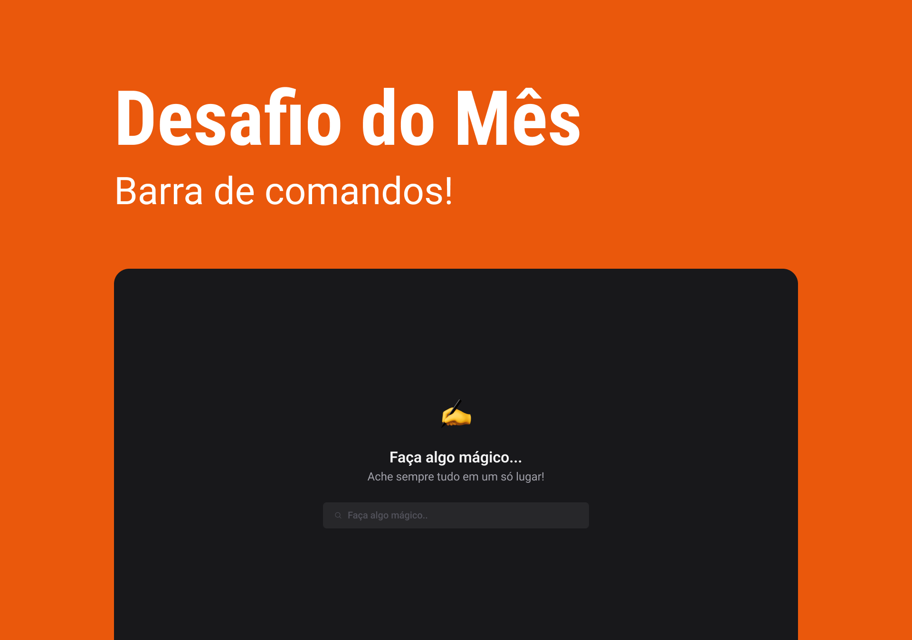

# Command Bar

> This is the Ballerini Community Challenge for the month of April: a site to find your favorite Discord communities
> &nbsp;

# Contents

- [Command Bar](#command-bar)
- [Contents](#contents)
- [About](#about)
  - [This is the Ballerini Community Challenge for the month of April: a site to find your favorite Discord communities](#this-is-the-ballerini-community-challenge-for-the-month-of-april-a-site-to-find-your-favorite-discord-communities)
- [Installation](#installation)
  - [Pre-requisites](#pre-requisites)
  - [Run this project](#run-this-project)
    - [Clone this repository](#clone-this-repository)
- [Technologies](#technologies)

# About

### This is the Ballerini Community Challenge for the month of April: a site to find your favorite Discord communities

&nbsp;

# Installation

### Pre-requisites

Before starting, you will need to have the following tools installed on your machine: [Git](https://git-scm.com), [Node.js](https://nodejs.org/en/) and [Npm](https://www.npmjs.com/). It's good to have an editor to work with the code like [VSCode](https://code.visualstudio.com/).

### Run this project

#### Clone this repository

```bash
git clone https://github.com/felipecepluki/command-bar.git
```

# Technologies

The following tools were used in building the project:

<div class="flex flex-row">


</div>
